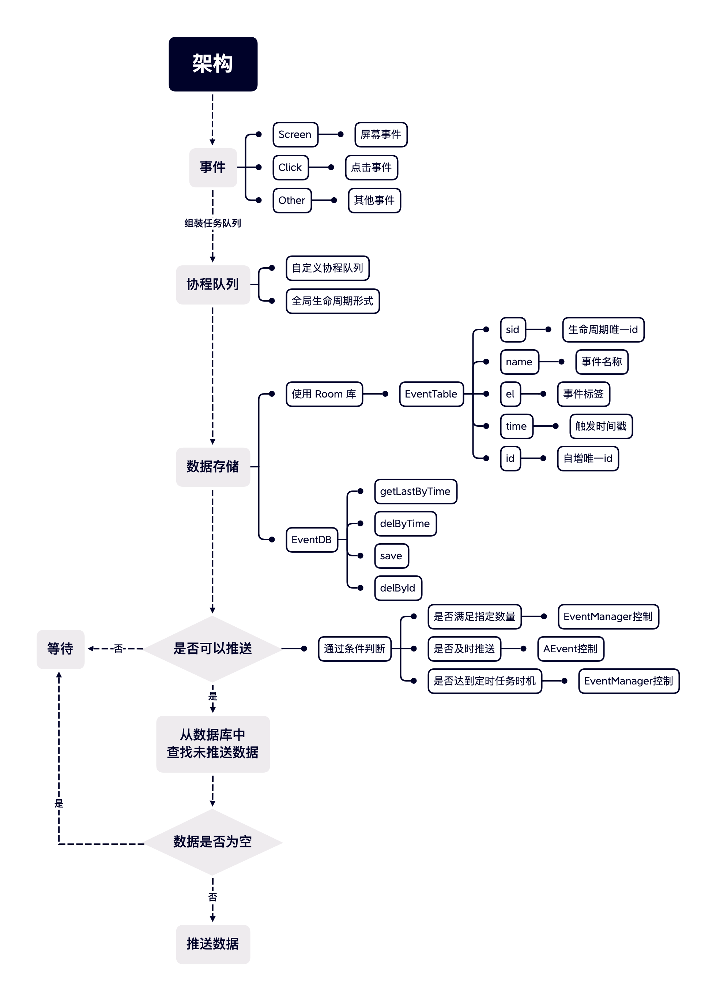

# Android 数据埋点基础库

## 介绍

此库并未使用 「AOP方式」插入统计代码，而是采用「手动添加方式」

这样做虽然代码侵入性较高，但是有高度定制型的优点，再加上公司业务需求高度定制规则较多，因此选择「手动添加方式」方式进行设计开发。

基础库整体架构流程如下图：



### 事件

* Click 点击事件
* Screen 屏幕事件
* Other 其他事件

```kotlin
data class EventData(
    val sid: String,//APP 生命周期内唯一ID
    val type: String,//类型 [EVENT] [SCREEN]
    val name: String,//事件名称
    val el: String,//事件标签
    private val msg: Map<String, String>?//自定义参数
)
```

代码示例：

```kotlin
//自定义事件
AEvent.event("share_image", "click", mutableMapOf("imageName" to "xxx.png"))

//屏幕事件示例
override fun onResume() {
    super.onResume()
    AEvent.screen(MainActivity::class.java.name, "show")
}

override fun onStop() {
    super.onStop()
    AEvent.screen(MainActivity::class.java.name, "dismiss")
}
```

### 数据库

数据库使用 Room 库开发，以「时间戳」进行查询未推送数据，可以根据时间戳进行删除或者主键ID进行删除

### 推送服务

用于将缓存数据推送到埋点服务器中，推送服务为定时任务，通过 `EventManager.delayTime`
与 `EventManager.intervalTime` 控制事件推送间隔

## 使用

此库并没有集成网络通信，需要实现 `INetService` 来实现数据上传功能
而 `INetService` 需要使用 kotlin 协程方式进行异步上传。

### NetService 实现

`INetService` 中有两个高级函数 `all` | `formArray`，在此处进行特殊讲解。

#### `all` 函数

可以通过一个接口将 List 数据上传

此携带 Boolean 返回，代表接口请求是否成功，如果返回 true 则代表数据上传成功，则缓存中上传数据需要删除。

#### `formArray` 函数

无法可以通过一个接口将 List 数据上传，而是遍历 List 数据逐条上传，因此需要将上传成功的数据库自增ID返回给SDK

此函数携带 List<Long> 返回 ，其中List 中储存上传成功的数据库自增ID，这些上传成功的数据需要再缓存中删除。

具体示例代码如下你可以使用某一中方式即可

```kotlin
class NetImpl : INetService {
    private val all = true
    private val debug = true
    override suspend fun push(
        list: Array<EventTable>,
        all: ((Boolean) -> Unit)?,
        fromArray: ((Long) -> Unit)?
    ) {
        //如果接口支持直接上传则使用 all 方式
        if (this.all) {
            try {
                if (debug) {
                    val builder = StringBuilder()
                    list.forEach {
                        builder.append(it.toString())
                    }
                    ALogger.logWrite("全部发送:$builder")
                    all?.invoke(true)
                } else {
                    RxHttp.get("todo").add("list", list).toAwait<String>().await()
                    all?.invoke(true)
                }
            } catch (e: Exception) {
                e.printStackTrace()
            }
        } else {

            list.forEach {
                //此处也可以根据自己业务需求进行定制操作
                val map = mutableMapOf<String, String>()
                map["pt"] = it.name
                map["en"] = it.el
                map["msg"] = it.msg
                if (it.isScreen) {
                    map["lp"] = "uuid"
                }
                if (debug) {
                    ALogger.logWrite("请求数据:$map")
                    fromArray?.invoke(it.id)
                } else {
                    try {
                        RxHttp.get("todo").addAll(map).toAwait<String>().await()
                        fromArray?.invoke(it.id)
                    } catch (e: Exception) {
                        e.printStackTrace()
                    }
                }
            }
        }
    }
}
```

### 初始化

```kotlin
EventManager.init(this).apply {
    config = EventConfig(debug = true)
    netService = NetImpl()
}
```

```kotlin
//自定义事件
AEvent.event("share_image", "click", mutableMapOf("imageName" to "xxx.png"))

//屏幕事件示例
override fun onResume() {
    super.onResume()
    AEvent.screen(MainActivity::class.java.name, "show")
}

override fun onStop() {
    super.onStop()
    AEvent.screen(MainActivity::class.java.name, "dismiss")
}
```

## 版本

### 1.0.0
* 初始化版本

